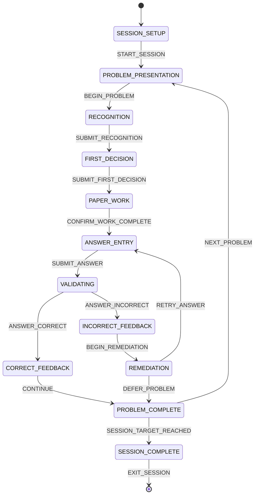

# Handwritten Practice State Machine and Event Flow

This is a proposed product state machine. It does not modify the production backend.



## State visibility contract

| State | Visible | Hidden |
|---|---|---|
| SESSION_SETUP | goal, scope, difficulty, count, time target, start | problem and answer |
| PROBLEM_PRESENTATION | session strip, progress, prompt, representation, continue | topic, recognition answer, method, answer, hint |
| RECOGNITION | persistent prompt, classification/clue controls | correct classification, method, answer, hint |
| FIRST_DECISION | persistent prompt, first-action control | correct action feedback, answer, hint |
| PAPER_WORK | persistent prompt, paper instruction, optional timer, work-complete | answer entry, hint, solution |
| ANSWER_ENTRY | persistent prompt, form-specific answer control, submit | expected answer, feedback, solution |
| VALIDATING | persistent prompt, noninteractive checking status | answer controls and feedback details |
| CORRECT_FEEDBACK | result, checks, next action | full solution unless separately requested/approved |
| INCORRECT_FEEDBACK | probable category, learner reflection, remediation action | expected answer and full solution |
| REMEDIATION | one bounded correction and retry | unrelated dashboard metrics, future steps |
| PROBLEM_COMPLETE | next/related choice and position | old answer form |
| SESSION_COMPLETE | session evidence, review items, exit | active problem controls |

## Submission event detail

```text
SUBMIT_ANSWER
→ UI creates answer submission (problem_id, answer, validator declaration)
→ ValidationService.validate() [current function: validate_answer()]
→ session service evaluates recognition and first decision [current: submit_attempt()]
→ AttemptRepository.add()
→ proposed ErrorDiagnosisService classifies incorrect work
→ ANSWER_CORRECT or ANSWER_INCORRECT
```

## Invariants

- Exactly one workflow state controls the main content region.
- No transition reveals the expected answer as a side effect.
- Persistence occurs once per submitted attempt, not on mere navigation.
- Professor Mode and Next-Line Coach use separate state machines.
