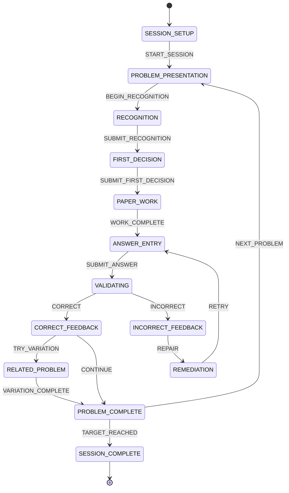
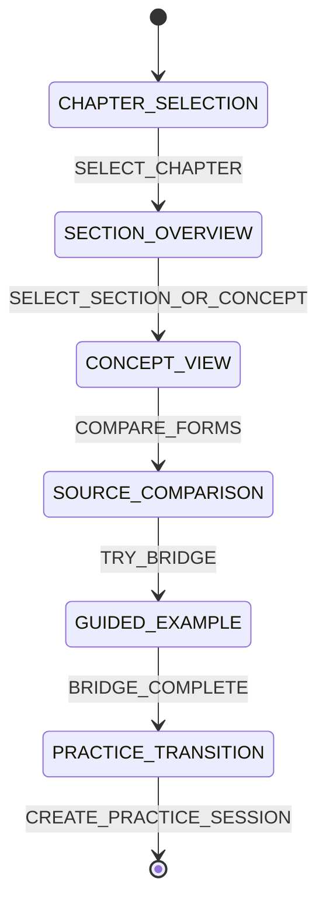
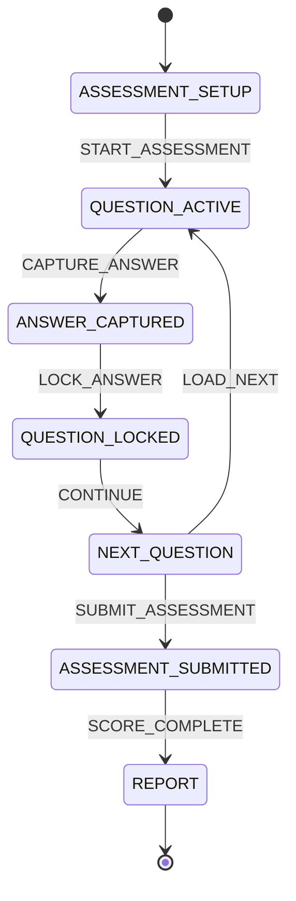

# Core State Machines

**Status:** proposed; owner approval required. Only one primary state may render at a time. Navigation chrome is not a second workflow state.

## Handwritten Practice

States: `SESSION_SETUP`, `PROBLEM_PRESENTATION`, `RECOGNITION`, `FIRST_DECISION`, `PAPER_WORK`, `ANSWER_ENTRY`, `VALIDATING`, `CORRECT_FEEDBACK`, `INCORRECT_FEEDBACK`, `REMEDIATION`, `RELATED_PROBLEM`, `PROBLEM_COMPLETE`, `SESSION_COMPLETE`.

## Course Review

States: `CHAPTER_SELECTION`, `SECTION_OVERVIEW`, `CONCEPT_VIEW`, `SOURCE_COMPARISON`, `GUIDED_EXAMPLE`, `PRACTICE_TRANSITION`.

## Professor Mode

States: `ASSESSMENT_SETUP`, `QUESTION_ACTIVE`, `ANSWER_CAPTURED`, `QUESTION_LOCKED`, `NEXT_QUESTION`, `ASSESSMENT_SUBMITTED`, `REPORT`.

## Rendering and transition rules

- A controller, not the Streamlit page, validates events and produces the next state/view model.
- Pages render the view model for the active state and emit one event.
- Invalid events preserve state and return a safe, state-specific message.
- Validation and persistence are idempotent at event boundaries.
- Back/exit/save behaviors are explicit events and require owner decisions.
- State history is domain/session data; widget keys are renderer data.
